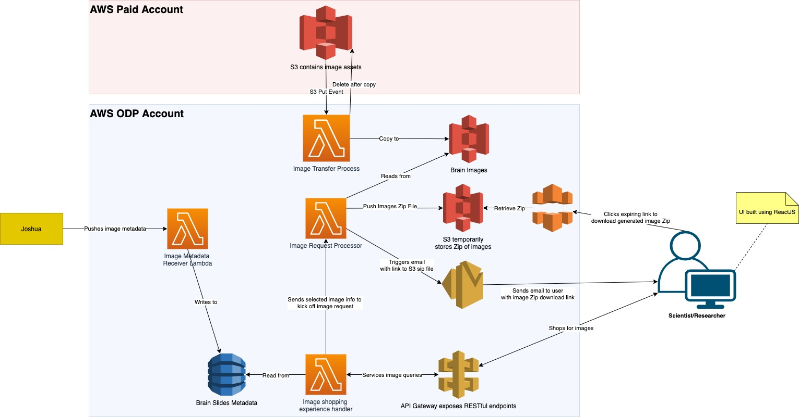

# charcot
> Putting brain images at the fingertips of scientists and researchers.


<!-- TOC titleSize:2 tabSpaces:2 depthFrom:1 depthTo:6 withLinks:1 updateOnSave:1 orderedList:0 skip:0 title:1 charForUnorderedList:* -->
## Table of Contents
* [charcot](#charcot)
    * [Overview](#overview)
      * [Transfer from Paid to ODP Account](#transfer-from-paid-to-odp-account)
      * [Image Metadata Receiver](#image-metadata-receiver)
      * [Image Shopping Experience](#image-shopping-experience)
      * [Image Zip Archive Delivery](#image-zip-archive-delivery)
    * [Install](#install)
      * [Requirements](#requirements)
      * [Steps](#steps)
    * [Usage](#usage)
      * [Image Metadata Receiver](#image-metadata-receiver)
      * [Image Shopping Experience](#image-shopping-experience)
    * [Developers](#developers)
<!-- /TOC -->

### Overview
_Note: Diagram below subject to change, click [here](https://drive.google.com/file/d/1a-1B2nF9x1TC3YpWshvbmzyU9oJc5W_N/view?usp=sharing) for the latest/greatest version_



Charcot allows interested parties to retrieve Zips of brain image data via a user-friendly graphical interface.

#### Transfer from Paid to ODP Account
Coming Soon

#### Image Metadata Receiver
Coming Soon

#### Image Shopping Experience
Coming Soon

#### Image Zip Archive Delivery
Coming Soon

### Install
The below steps assume a Mac OS or Unix-like systems only.

#### Requirements
1. [nvm](https://github.com/nvm-sh/nvm#profile_snippet)
   ```
   curl -o- https://raw.githubusercontent.com/nvm-sh/nvm/v0.39.0/install.sh | bash
   ```
2. `node`, using `nvm` command that you installed above,
   ```
   nvm install node
   ```
3. [git](https://git-scm.com/book/en/v2/Getting-Started-Installing-Git)
4. An [AWS cloud account](https://console.aws.amazon.com/), and the `aws cli`. The steps on how to do this are beyond the scope of this document, but on mac you can do `brew install aws`
and then `aws configure` to configure access to your AWS account from the command line.


#### Steps
1. Git clone repo at https://github.com/joquijada/charcot,
   `git clone git@github.com:joquijada/charcot.git`
2. Install dependencies, `npm install`
3. Deploy to the app to the cloud, `AWS_PROFILE=<your AWS profile> npx sst deploy`

### Usage

#### Image Metadata Receiver
Coming soon

#### Image Shopping Experience
Coming Soon - Load UI at URL XYZ

### Developers
Take a look at the [contributing](./CONTRIBUTING.md) and [developer](./doc/developer/README.md) guides if you plan to develop for charcot.
