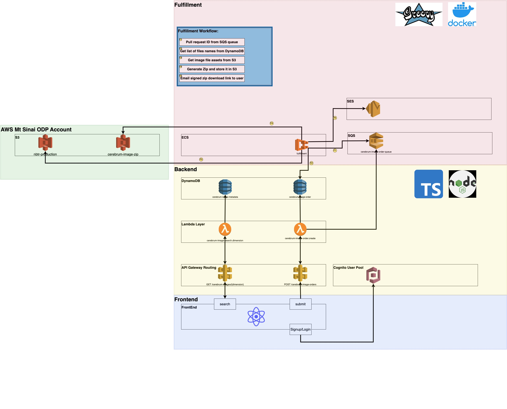
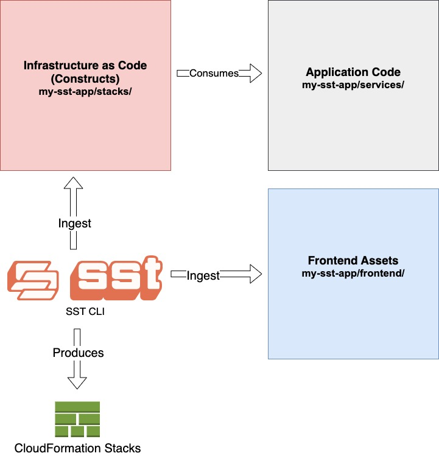

# architecture

_Note: Diagram below subject to change,
click [here](https://drive.google.com/file/d/186kz3Zlz_FbDa1xWUFU0tDz_yZHA2e2d/view?usp=sharing) for the latest/greatest
version_

### SST

[SST](https://docs.sst.dev/what-is-sst) is a framework built on top of AWS CDK to deploy full-stack applications. While
the technical details of SST are beyond the scope of this document, a few of the benefits of SST are:

- Live Lambda development environment for debugging
- Support to deploy front end
- Full access to all of AWS CDK constructs
- Support for two or more environments within the same AWS account, aka stages

Below diagram is a high level overview of SST. Strongly recommend to watch video at the top of the page
located [here](https://docs.sst.dev/what-is-sst) to learn more.

### Components

#### Front End

Charcot uses React.js and React Bootstrap for the front end. The front end communicates with the back end via the API
Gateway routes exposed and RESTful endpoints. The stack code can be found [here](../../stacks/FrontEndStack.ts)

#### Back End

The backend code is split into two stack files, [one](../../stacks/BackEndOdpStack.ts) that provisions the resources
that belong in the AWS Mt Sinai ODP account, and [the other](../../stacks/BackEndPaidAccountStack.ts) provisions
resources that go in the AWS Mt Sinai paid account.

#### Fulfillment

The fulfillment module is built using Groovy and deployed as Docker containers. This module is responsible for handling
the workload to generate image zips and email those to the requester. AWS ECS is used to orchestrate scaling out/in of
the instances as demand increases/decreases respectively.
The stack code for the fulfillment module can be found [here](../../stacks/FulfillmentStack.ts).
