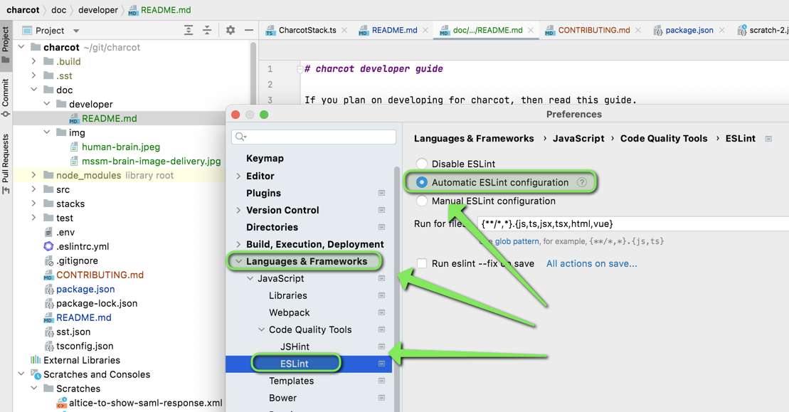

# charcot developer guide
> If you plan on developing for charcot, then read this guide.

<!-- TOC titleSize:2 tabSpaces:2 depthFrom:1 depthTo:6 withLinks:1 updateOnSave:1 orderedList:0 skip:0 title:1 charForUnorderedList:* -->
## Table of Contents
* [charcot developer guide](#charcot-developer-guide)
    * [Set Up](#set-up)
    * [Developing](#developing)
      * [Testing](#testing)
      * [Linting](#linting)
<!-- /TOC -->

### Set Up
In addition to [the requirements outlined in the project README](../../README.md#install), install the following:
1. [IntelliJ WebStorm](https://www.jetbrains.com/webstorm/)
2. ESLint, `npm -g eslint`

### Developing
You need to know [TypeScript](https://www.typescriptlang.org/docs/) in order to program for charcot. A great way to get started is to read entire [TypeScript handbook](https://www.typescriptlang.org/docs/handbook/intro.html).

#### Testing
>  This product uses Jest for writing unit tests
- If applicable, ensure you write unit tests for any code you write/modify. Then run them via `npm test`
  > 👉 When run this, it will lint and test the code as well.
- You can test your work locally by running `npx start -- --stage dev`

#### Linting
>  The code uses ESLint for linting. This is bundled with serverless stack (SST)

- Enable linting in WebStorm, `WebStorm -> Preferences -> Languages & Frameworks -> ESLint -> Automatic ESLint Configuration`. This allows you to lint code as you write it.
  
- Can also fix lint issues from the command line, `npm run lint:fix`.
- The app is configured to lint when you run tests. If linting fails, tests will not run. Therefore you need to fix linting issues using command above. Some linting issues need to be fixed manually.
